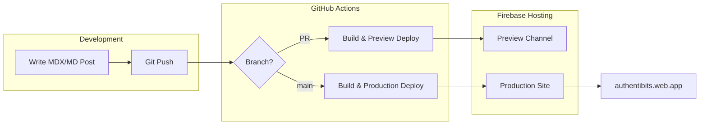

# Authentibits

A personal technical blog built with [Astro](https://astro.build), hosted on [Firebase Hosting](https://firebase.google.com/docs/hosting).

## Architecture



## Features

- Static site generation with Astro 5
- MDX support for interactive blog posts
- Tailwind CSS for styling
- Automatic sitemap and RSS feed
- SEO-optimized with OpenGraph support
- CI/CD with GitHub Actions
- Preview deployments for PRs

## Project Structure

```
authentibits/
├── .github/workflows/     # CI/CD workflows
├── src/
│   ├── assets/           # Images and static assets
│   ├── components/       # Astro components
│   ├── content/blog/     # Blog posts (MD/MDX)
│   ├── layouts/          # Page layouts
│   ├── pages/            # Route pages
│   └── styles/           # Global styles
├── public/               # Static files
├── astro.config.mjs      # Astro configuration
└── firebase.json         # Firebase Hosting config
```

## Commands

| Command           | Action                                      |
| :---------------- | :------------------------------------------ |
| `npm install`     | Install dependencies                        |
| `npm run dev`     | Start dev server at `localhost:4321`        |
| `npm run build`   | Build production site to `./dist/`          |
| `npm run preview` | Preview build locally before deploying      |

## Writing Blog Posts

1. Create a new `.md` or `.mdx` file in `src/content/blog/`
2. Add frontmatter with required fields:

```yaml
---
title: 'Your Post Title'
description: 'Brief description for SEO'
pubDate: 'Dec 21 2024'
heroImage: '../../assets/blog-placeholder-1.jpg'
---
```

3. Write your content in Markdown/MDX
4. Commit and push - CI/CD handles the rest

## Deployment

### Automatic (CI/CD)
- **Pull Requests**: Automatically deploys to a preview channel
- **Main Branch**: Automatically deploys to production

### Manual (if needed)
```bash
npm run build
npx firebase deploy --only hosting
```

## Setup for New Contributors

1. Clone the repository
2. Install dependencies: `npm install`
3. Start dev server: `npm run dev`
4. Create a Firebase project named `authentibits`
5. Add `FIREBASE_SERVICE_ACCOUNT_AUTHENTIBITS` secret to GitHub

## License

MIT
