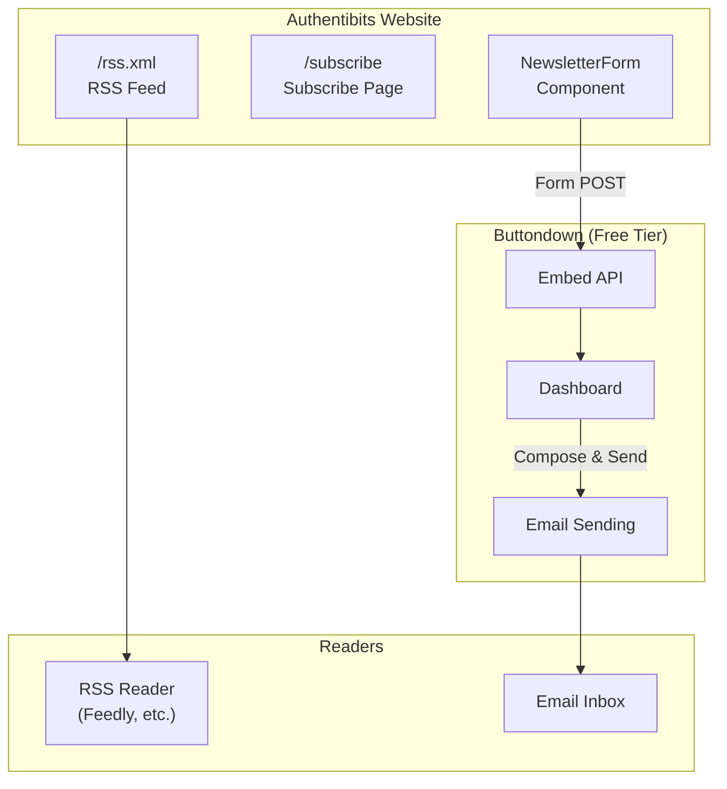

# Newsletter and RSS Feed Setup Guide

This document explains how to configure and maintain the newsletter subscription system and RSS feed for Authentibits.

## Architecture Overview



## Newsletter Setup (Buttondown)

### Why Buttondown?

- **Free tier**: Up to 100 subscribers at no cost
- **Simple**: Minimalist, developer-friendly interface
- **No backend needed**: Works with static sites via embed forms
- **Trusted**: Used by Astro's official newsletter
- **Portable**: Easy export if you outgrow the platform

### Setup Steps

1. **Create Account**
   - Go to [buttondown.com](https://buttondown.com)
   - Sign up for a free account
   - Complete email verification

2. **Configure Your Newsletter**
   - Set your newsletter name and description
   - Customize your welcome email (optional)
   - Configure sender settings

3. **Get Your Username**
   - Go to Settings in Buttondown
   - Your username is shown in your profile URL: `buttondown.com/YOUR_USERNAME`

4. **Update the Configuration**

   Edit `src/consts.ts` and replace the placeholder:
   ```typescript
   export const NEWSLETTER_USERNAME = "your-actual-username";
   ```

5. **Deploy**
   - Push changes to trigger deployment
   - The newsletter form will now be functional

### Sending Newsletters

1. Log into [buttondown.com](https://buttondown.com)
2. Click "New email" to compose
3. Write your newsletter content (supports Markdown)
4. Preview and send to all subscribers

### Managing Subscribers

- View all subscribers in the Buttondown dashboard
- Export subscribers anytime (CSV format)
- Handle unsubscribes automatically

## RSS Feed

### How It Works

The RSS feed is automatically generated at build time using `@astrojs/rss`. Every blog post in `src/content/blog/` is included in the feed.

### Feed URL

```
https://authentibits.web.app/rss.xml
```

### Features

- Automatically sorted by publication date (newest first)
- Includes Atom namespace for better compatibility
- Self-referencing link for feed discovery
- Meta tag in `<head>` for browser RSS detection

### Customization

Edit `src/pages/rss.xml.js` to modify:
- Feed title and description (from `src/consts.ts`)
- Items included in the feed
- Custom XML namespaces

## Component Reference

### NewsletterForm Component

Located at: `src/components/NewsletterForm.astro`

**Props:**
| Prop | Type | Default | Description |
|------|------|---------|-------------|
| `variant` | `'inline' \| 'card'` | `'card'` | Visual style of the form |
| `showDescription` | `boolean` | `true` | Show heading and description |

**Usage:**
```astro
---
import NewsletterForm from "../components/NewsletterForm.astro";
---

<!-- Card style (default) -->
<NewsletterForm />

<!-- Inline style without description -->
<NewsletterForm variant="inline" showDescription={false} />
```

### Where the Form Appears

1. **Footer** - Every page has the newsletter signup
2. **Subscribe Page** - Dedicated page at `/subscribe`

## Maintenance

### Upgrading from Free Tier

If you exceed 100 subscribers, Buttondown offers paid plans starting at $9/month. The integration code doesn't need to change.

### Alternative Services

If you need to migrate, consider these alternatives:

| Service | Free Tier | Notes |
|---------|-----------|-------|
| Kit (ConvertKit) | 10,000 subscribers | More features, landing pages |
| MailerLite | 1,000 subscribers | Good automation |
| EmailOctopus | 2,500 subscribers | Simple, has branding |

### Switching Newsletter Providers

1. Export subscribers from current provider (CSV)
2. Create account with new provider
3. Import subscribers
4. Update embed form in `NewsletterForm.astro`
5. Update configuration in `consts.ts` if needed

## Testing

### Local Testing

```bash
npm run dev
```

- Visit `http://localhost:4321/subscribe` to see the subscribe page
- Check the footer on any page for the newsletter form
- Visit `http://localhost:4321/rss.xml` to verify RSS feed

### Verify RSS Feed

Use an RSS validator like:
- [W3C Feed Validation Service](https://validator.w3.org/feed/)
- [Feed Validator](https://www.feedvalidator.org/)

### Test Newsletter Signup

1. Configure your Buttondown username
2. Submit a test email through the form
3. Check your Buttondown dashboard for the new subscriber

## Troubleshooting

### Form not working

- Verify `NEWSLETTER_USERNAME` is set correctly in `src/consts.ts`
- Check browser console for JavaScript errors
- Ensure the form action URL is accessible

### RSS feed empty

- Verify blog posts exist in `src/content/blog/`
- Check that posts have valid frontmatter with `pubDate`
- Run `npm run build` and check for errors

### Subscribers not appearing

- Check Buttondown dashboard for pending confirmations
- Verify email isn't in spam folder
- Double-check the username configuration
